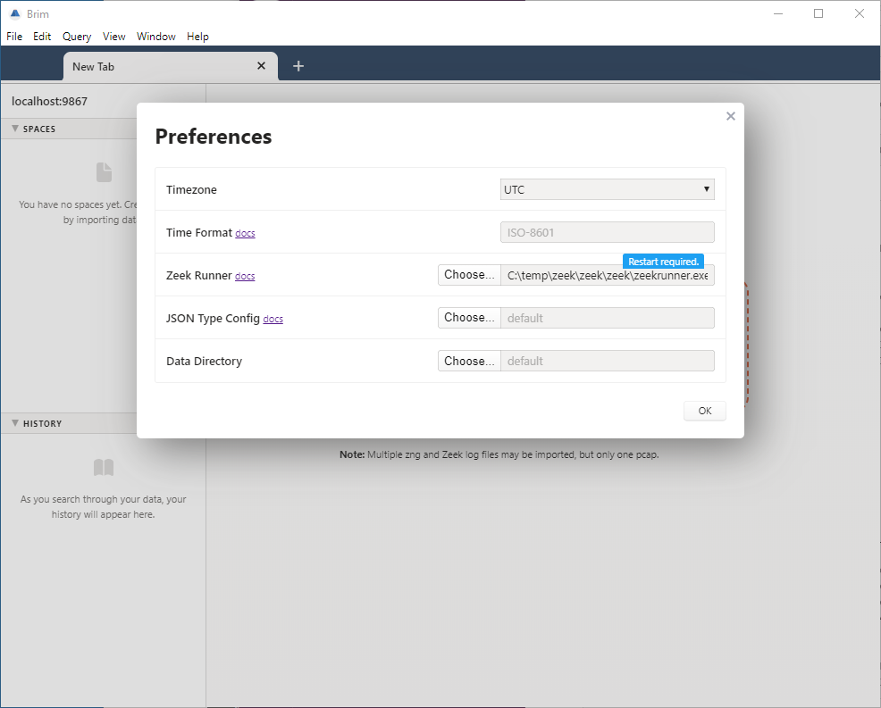
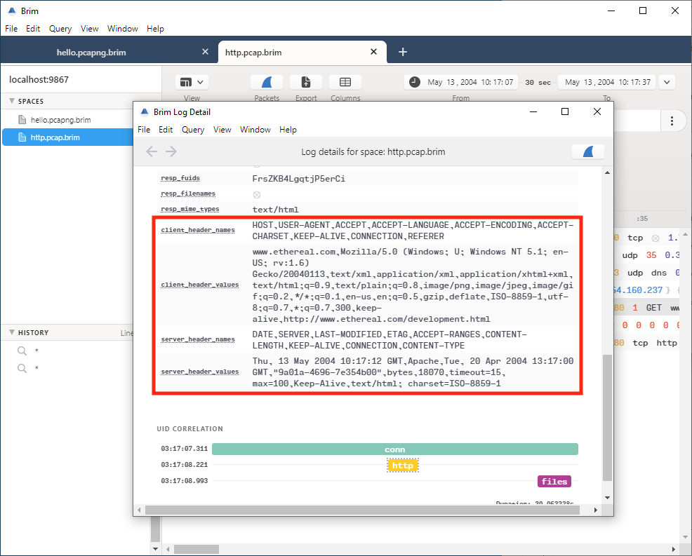

# Zeek Customization

- [Summary](#summary)
- [Zeek Runner Configuration](#zeek-runner-configuration)
- [Creating Your Customized Zeek](#creating-your-customized-zeek)
   * [Example](#example)
- [Contact us!](#contact-us)

# Summary

Brim uses [Zeek](https://www.zeek.org) to generate Zeek logs from pcaps; the Zeek logs are then combined and stored in
 [ZNG](https://github.com/brimsec/zq/blob/master/zng/docs/spec.md) format. Brim comes with a Zeek bundle
it uses just for this process.

Starting with `v0.10.0`, Brim can be configured to use a Zeek setup other than its default. This may be useful for:

   * Users with an existing Zeek installation, to generate logs in Brim similar to their existing Zeek logs.
   * Users that want to experiment with a Zeek configuration different from the Brim default.
   * Zeek script authors that would like to use Brim as a script development aid.

To use a different Zeek setup, there is now a Brim preference to specify the Zeek "runner", an executable script or 
command run when a pcap import occurs, which launches Zeek to read the pcap's data & write Zeek logs. The next
section describes how to change the runner preference to point to an existing customized Zeek install, and
the subsequent section shows how to optionally use Brim's own Zeek binary packages as a starting point to create your
customized Zeek.

# Zeek Runner Configuration

Brim uses an executable script or command, called a Zeek "runner", to execute Zeek with any needed environment variables,
command line options, or other configuration. A Brim preference is available to specify the location of the Zeek runner
to use. To use a different Zeek setup to generate logs from pcaps, you should provide a runner that references the
desired Zeek setup.

Below is the runner in Brim v0.10.0 that invokes the included Zeek bundle on Linux and macOS. It's a script located at the top of the builtin
Zeek bundle's installation directory, so it refers to the Zeek executable and other paths relative to its own location.
On Windows, an executable `zeekrunner.exe` with equivalent functionality is used instead.
When a user imports a pcap file into Brim, the runner is executed with the pcap's data passed via stdin, and the 
runner's working directory set to the desired output location for the Zeek logs. 

```bash
#!/usr/bin/env bash

dir="$(cd "$(dirname "${BASH_SOURCE[0]}")" >/dev/null 2>&1 && pwd)"

export ZEEKPATH="$dir/share/zeek:$dir/share/zeek/policy:$dir/share/zeek/site"
export ZEEK_PLUGIN_PATH="$dir/lib/zeek/plugins"

# The packet filter and loaded scripts are disabled because they emit either
# timeless logs or logs with timestamp set to execution time rather than time
# of capture.
exec "$dir/bin/zeek" \
  -C -r - \
  --exec "event zeek_init() { Log::disable_stream(PacketFilter::LOG); Log::disable_stream(LoadedScripts::LOG); }" \
  local
```

The above script works as-is for a Zeek installation created by the Zeek build system. So, if you've built Zeek locally
via `./configure --prefix=/usr/local/myzeek`, you could copy the above script to `/usr/local/myzeek/zeekrunner`, then
specify `/usr/local/myzeek/zeekrunner` in the Brim preferences, restart Brim, and then import pcaps using the Zeek
setup at `/usr/local/myzeek`.

**Note:** If you change the location of the Zeek runner, you'll need to restart Brim. However, a
restart is only required if the location of the runner changes, not if the runner itself is updated. If you edit the
runner without altering its location, any changes will take effect on the next pcap import.

You can specify the location of your Zeek runner via the setting in the **Preferences** menu:


# Creating Your Customized Zeek

If you're experienced at [installing Zeek](https://docs.zeek.org/en/current/install/install.html), you may have the best luck
by building and testing your Zeek installation via those standard instructions. This will give you the most flexibility in
terms of being able to to compile plugins, use the [Zeek Package Manager](https://docs.zeek.org/projects/package-manager/en/stable/)
to add extensions, or even make changes to the core Zeek C++ code if you choose.

However, situations may arise when this is difficult. Some examples:

1. **Microsoft Windows**. Zeek is not officially supported on Windows, and Brim's
[fork of Zeek](https://github.com/brimsec/zeek) that includes limited Windows support is unfortunately not easy to compile
outside of a customized build environment.
2. **Minimal changes**. If you seek to only make minor Zeek script additions/changes, creating a full standalone Zeek install
may seem like overkill.
3. **Lack of expertise**. The Zeek install/build process may seem daunting to new users.

In such situations, you may be able to start from one of the binary Zeek artifacts that's bundled into Brim and add your
customizations. However, you should be aware of the following limitations:

1. **Only customizations involving Zeek scripts are possible.** Zeek plugins that include C++ code still require a build
environment.
2. **Script additions/changes must be performed manually**, as the
[Zeek Package Manager](https://docs.zeek.org/projects/package-manager/en/stable/) is not available in the Brim Zeek artifacts.

## Example

The following example shows how to create and use such a customized Zeek, in this case to add the
scripts from the [zeek-log-all-http-headers](https://github.com/sethhall/zeek-log-all-http-headers) package. PowerShell on
Windows is used here, but as the steps involve only unpacking and editing files, the equivalent steps on macOS and Linux
should be intuitive.

1. **Create an empty folder** in which to create the custom Zeek

```
PS C:\> mkdir \temp\zeek
PS C:\> cd \temp\zeek
```

2. **Download and unpack a current Brim Zeek artifact** for the platform from the
[releases](https://github.com/brimsec/zeek/releases) page.

```
PS C:\temp\zeek> Invoke-WebRequest -Uri "https://github.com/brimsec/zeek/releases/download/v3.2.0-dev-brim6/zeek-v3.2.0-dev-brim6.windows-amd64.zip" -OutFile zeek.zip
PS C:\temp\zeek> Expand-Archive zeek.zip
```

3. **Add/modify the Zeek scripts as necessary.** In this case, we're going to be enabling the Zeek scripts from the
[zeek-log-all-http-headers](https://github.com/sethhall/zeek-log-all-http-headers) package. Since the scripts are in a GitHub
repo, this can most easily be done if we have [`git`](https://git-scm.com/) installed and in our path. Customizations are
added within/below the `zeek/share/zeek/site/` directory, so that's where we'll unpack them here.

```
PS C:\temp\zeek> cd zeek\zeek\share\zeek\site
PS C:\temp\zeek\zeek\zeek\share\zeek\site> git clone https://github.com/sethhall/zeek-log-all-http-headers
```

4. **Ensure the added/modified scripts are loaded by Zeek.** Brim's Zeek Runner always loads `zeek/share/zeek/site/local/local.zeek`,
so we add a line to the end of this file with an appropriate Zeek `@load` directive.

```
PS C:\temp\zeek\zeek\zeek\share\zeek\site> Write-Output '@load zeek-log-all-http-headers/scripts' | out-file .\local.zeek -Encoding ASCII -Append
```

5. **Test the customized Zeek.** If the modifications to the custom Zeek aren't working outside of Brim, they'll never work
when invoked by Brim. To test, pipe a packet capture through the Zeek Runner script to generate logs, then examine the logs to see if the
expected changes are present. Since PowerShell has problems piping binary data, we invoke the old-fashioned Command Prompt here to finish
the test. The `NB-DNS` error messages on Windows can be ignored.

```
PS C:\temp\zeek\zeek\zeek> Invoke-WebRequest -Uri "https://wiki.wireshark.org/SampleCaptures?action=AttachFile&do=get&target=http.cap" -OutFile \temp\http.pcap
PS C:\temp\zeek\zeek\zeek> cd \temp\zeek\zeek\zeek

PS C:\temp\zeek\zeek\zeek> cmd
Microsoft Windows [Version 10.0.19041.388]
(c) 2020 Microsoft Corporation. All rights reserved.

C:\temp\zeek\zeek\zeek>type \temp\http.pcap | .\zeekrunner.exe
warning in <command line>, line 7: problem initializing NB-DNS: res_init() failed
WARNING: No Site::local_nets have been defined.  It's usually a good idea to define your local networks.
C:\temp\zeek\zeek\zeek>type http.log
#separator \x09
#set_separator  ,
#empty_field    (empty)
#unset_field    -
#path   http
#open   2020-08-10-12-25-39
#fields ts      uid     id.orig_h       id.orig_p       id.resp_h       id.resp_p       trans_depth     method  host    uri   referrer version user_agent      origin  request_body_len        response_body_len       status_code     status_msg      info_code      info_msg        tags    username        password        proxied orig_fuids      orig_filenames  orig_mime_types resp_fuids     resp_filenames  resp_mime_types client_header_names     client_header_values    server_header_names     server_header_values
#types  time    string  addr    port    addr    port    count   string  string  string  string  string  string  string  count count    count   string  count   string  set[enum]       string  string  set[string]     vector[string]  vector[string]  vector[string] vector[string]  vector[string]  vector[string]  vector[string]  vector[string]  vector[string]  vector[string]
1084443428.222534       CwqdUJ2O57bup6U6nk      145.254.160.237 3372    65.208.228.223  80      1       GET     www.ethereal.com       /download.html  http://www.ethereal.com/development.html        1.1     Mozilla/5.0 (Windows; U; Windows NT 5.1; en-US; rv:1.6) Gecko/20040113 -       0       18070   200     OK      -       -       (empty) -       -       -       -       -     -FrsZKB4LgqtjP5erCi      -       text/html       HOST,USER-AGENT,ACCEPT,ACCEPT-LANGUAGE,ACCEPT-ENCODING,ACCEPT-CHARSET,KEEP-ALIVE,CONNECTION,REFERER    www.ethereal.com,Mozilla/5.0 (Windows; U; Windows NT 5.1; en-US; rv:1.6) Gecko/20040113,text/xml\x2capplication/xml\x2capplication/xhtml+xml\x2ctext/html;q=0.9\x2ctext/plain;q=0.8\x2cimage/png\x2cimage/jpeg\x2cimage/gif;q=0.2\x2c*/*;q=0.1,en-us\x2cen;q=0.5,gzip\x2cdeflate,ISO-8859-1\x2cutf-8;q=0.7\x2c*;q=0.7,300,keep-alive,http://www.ethereal.com/development.html        DATE,SERVER,LAST-MODIFIED,ETAG,ACCEPT-RANGES,CONTENT-LENGTH,KEEP-ALIVE,CONNECTION,CONTENT-TYPE  Thu\x2c 13 May 2004 10:17:12 GMT,Apache,Tue\x2c 20 Apr 2004 13:17:00 GMT,"9a01a-4696-7e354b00",bytes,18070,timeout=15\x2c max=100,Keep-Alive,text/html; charset=ISO-8859-1
#close  2020-08-10-12-25-39
```

Because of what we know about this package, the presence of the additional fields like `client_header_names` and `client_header_values`
tells us it's working correctly.

6. **Set the Zeek Runner Preference.** Since the above test was successful, we now follow the instructions
[above](#zeek-runner-configuration) to set the Brim preference for the location of the Zeek Runner, restart Brim, and import
a pcap to confirm it works in the app.





# Contact us!

If you're using a custom Zeek setup with Brim, we'd like to hear from you! Whether you've found an interesting 
Zeek feature that could be useful to other Brim users, or are generating logs that match your existing Zeek setup, 
or (especially) if you hit challenges and need help, please join our
[public Slack](https://join.slack.com/t/brimsec/shared_invite/zt-cy34xoxg-hZiTKUT~1KdGjlaBIuUUdg)
and tell us about it, or
[open an issue](https://github.com/brimsec/brim/wiki/Troubleshooting#opening-an-issue). Thanks!
